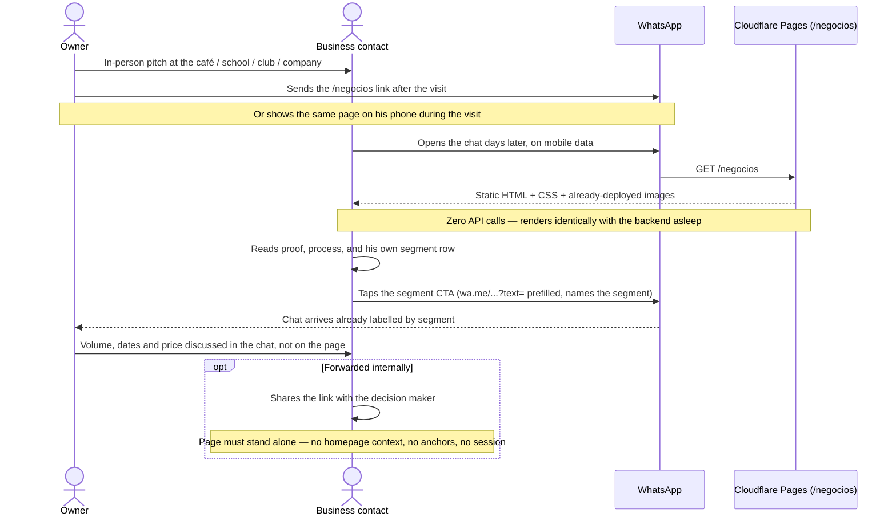

# Design: B2B outbound collateral page (`/negocios`)

Companion to `proposal.md`. Capability spec: `specs/business-landing/spec.md` (written in parallel).
All settled constraints from the proposal are treated as fixed inputs and are not reopened here.

## Technical Approach

A build-time-only static page. `src/lib/business-segments.ts` holds typed segment content;
`src/pages/negocios.astro` maps it into markup at build time through one repeated component; the
result is HTML, CSS and already-deployed images on Cloudflare Pages. No runtime data, no `api.ts`,
no fetch, no adapter — the page is fully painted the instant it lands, which is the only behaviour
that survives being opened mid-pitch on mobile data with the backend asleep.

The visual thesis: **the page is a document, not a poster.** The B2C page sells with candy cards,
pixel penguins and bounce. This page sells with a ruled ledger, one number, and silence around it.
The brand guide already sanctions this register — it describes the identity as *"una dirección
madura y adaptable frente a una línea demasiado caricaturesca"* — so elegance here is not a new
brand, it is the mature end of the existing one.

## Architecture Decisions

### Decision: single static route `src/pages/negocios.astro`

| Option | Tradeoff | Verdict |
|---|---|---|
| Single `/negocios` page | One link to paste and say aloud; sitemap auto-picks it up under `output: "static"` | **Chosen** |
| `/negocios/[segmento]` | 4× content to maintain, splits the proof story, contradicts "one link" | Rejected |
| Another homepage section | Reader arrives cold, days later, with no homepage context | Rejected |

**Rationale**: settled by the owner and confirmed by `astro.config.mjs:7` (`output: "static"`, no
`@astrojs/node`). A new file under `src/pages/` is the entire routing story: no redirects, no
functions, no config change, so rollback is `git revert` plus a static rebuild.

### Decision: content lives in a typed module, not in page frontmatter

| Option | Tradeoff | Verdict |
|---|---|---|
| `src/lib/business-segments.ts` | Real Vitest surface; turns the no-price and no-voseo owner rules into executable guarantees | **Chosen** |
| Inline `const` in `negocios.astro` | Zero test surface — the change would ship with no RED-GREEN step under strict TDD | Rejected |
| Astro content collections | Schema + collection config for 4 hand-written records; heavier than the problem | Rejected |

**Rationale**: the module exists so that "no prices" and "no voseo" are enforced by CI rather than
by reviewer etiquette. Test-only regexes stay in the test file — no production code exists purely
to serve tests.

### Decision: extract only the repeated unit as a component

The homepage convention is one component per section. This page deviates: the six one-off sections
live inline in `negocios.astro`, and only `BusinessSegmentRow.astro` (rendered ×4) is extracted.

**Rationale**: extraction is justified by repetition, not by ceremony. Six extra files that each
have exactly one caller would scatter the copy, add ~90 lines of import/props boilerplate, and push
PR 1 further over the review budget. The segment row is the only true repeat, and it is also where
the optional-media composition logic lives, so it earns its file.

### Decision: no scroll-triggered reveals anywhere on this page

One GSAP entrance timeline on the header, no `ScrollTrigger`, no `.animate-on-scroll` usage below
the fold. Everything past the first screen is visible the moment it paints.

**Rationale**: this is both an elegance decision and a reliability one. The reader scrolls fast on a
phone, sometimes while the owner is standing next to him. Reveal-on-scroll animations are exactly
the class of effect that leaves content stuck at `opacity: 0` when a script is slow, blocked, or
half-loaded on mobile data. Because the timeline uses `.from()`, the DOM's natural state is the
visible state — if GSAP never loads, the page is simply static and correct.

### Decision: reuse `BaseLayout.astro` unchanged, and extend the no-price rule to structured data

`jsonLd` reuses the `Organization` shape from `index.astro` **without the `offers` array**. No
`Offer`, no `price`, no `priceRange` anywhere in the document, including metadata.

**Rationale**: the no-price invariant is about what the buyer can find, not about what is visually
rendered. Structured data is public surface.

## Component Tree

```
src/pages/negocios.astro
└── BaseLayout.astro  (title, description, ogImage, canonicalUrl, jsonLd)
    └── <main class="negocios">
        ├── §1 Identity header   inline — logo-horizontal.svg, eyebrow, H1, lead, primary CTA
        ├── §2 Proof line        inline — "+120", "3 años"
        ├── §3 How we work       inline — 4 ordered steps, the only orange on the page
        ├── §4 Segment ledger    inline wrapper
        │   └── BusinessSegmentRow.astro ×4   ← the only extracted component
        ├── §5 Product line      inline — existing public/ photography
        ├── §6 Volume framing    inline — price scales, zero figures
        └── §7 Closing CTA       inline — full-bleed magentaDeep band
    <script> import "~/scripts/negocios-animation.js"
```

| Unit | Responsibility |
|---|---|
| `negocios.astro` | Page composition, metadata, JSON-LD, iterating `BUSINESS_SEGMENTS`, all one-off section copy |
| `BusinessSegmentRow.astro` | One ledger row: title, lead, bullets, segment CTA, and the media-vs-no-media composition |
| `business-segments.ts` | Typed segment content + `segmentWhatsappLink()` |
| `negocios-animation.js` | The single header entrance timeline |
| `global.css` (appended `.negocios-*`) | Only what utilities cannot express: bullet markers, ledger grid, media frame, numeral typography |

## Visual Design, Section by Section

Every row below is a checkable decision, contrasted against what the B2C page does today.

| Axis | B2C page today | `/negocios` |
|---|---|---|
| Surfaces | White cards on cream, `rounded-3xl`, `shadow-card`/`shadow-soft` | **Cream is the only surface.** Zero `shadow-*` classes (focus rings excepted), zero card radius. Structure comes from 1px `border-horno-magentaDeep/12` hairlines |
| Palette | Orange as a repeated motif; magenta body copy | Weighted to `magentaDeep` (headings) + `ink/75` (body). **Orange appears in exactly one role**: the four step numerals in §3 |
| H1 | `text-4xl sm:text-5xl lg:text-6xl`, `leading-[1.02]`, two colours mid-sentence | `text-3xl sm:text-[2.75rem] lg:text-5xl`, `leading-[1.12]`, `tracking-[-0.02em]`, **one colour**. Deliberately smaller than the B2C hero — a proposal is not a poster |
| Section headings | `text-3xl sm:text-4xl`, colour swaps | `text-2xl sm:text-3xl` Fraunces, single `magentaDeep` |
| Eyebrow | `.eyebrow` inside a white pill with `shadow-card` | `.eyebrow` bare: uppercase, `tracking-[0.3em]`, `magenta/60`, no pill, no shadow |
| Body | Poppins on `magentaDeep/75`, short measure | Poppins 400 on `ink/75`, `leading-relaxed`, measure capped at `max-w-[58ch]` |
| Rhythm | Mixed `py-14`/`py-16 sm:py-20`/`sm:py-24` | Uniform `py-20 sm:py-28` across all seven sections; text sections sit in an inner `max-w-3xl` column while the ledger uses the full `.section` width |
| Proof number | Animated counters elsewhere on the site | **Static** `+120` in Fraunces `text-5xl sm:text-6xl`, `font-variant-numeric: tabular-nums`, label in Poppins `text-xs uppercase tracking-[0.28em]`. No counter animation: a number that counts up is a performance, and this one has to read as a fact |
| Imagery | Pixel-art chef penguins | Product photography only. **No penguin sprite renders on this page** — checkable: zero `penguin-*` classes or `/penguin-*.png` references in `negocios.astro` |
| Motion | Multiple effects + magnetic CTAs | One header timeline. **Zero `data-magnetic` attributes** on this page (`magnetic-cta.js` binds only that attribute, so omitting it is sufficient); Lenis smooth scrolling stays, since it is scroll behaviour, not decoration |

**Signature element — the segment ledger.** §4 is not four cards; it is one continuous ruled table.
Each segment is a row separated by a hairline, with the segment name set large in Fraunces on the
left, its operational bullets in a second column, and a media gutter on the right. It reads like a
delivery sheet or an order book — an artefact from the buyer's own world — which is why it feels
like a document he can act on rather than an ad he has to discount. This is the one place boldness
is spent; everything around it stays quiet.

**Photography, honestly.** Available assets are product shots only — no café shelf, no school
event, no office. Assignment: cafeterías → `destacada-catalogo.jpg` (assortment), colegios →
`producto-mini-donas.jpg` (portioning), empresas → `producto-torta-mariposas.jpg`, §5 →
`chesscake-hero.png` / `destacada-favoritos.jpg`. Treatment: `aspect-[4/3]`, `object-cover`, no
radius, 1px hairline, no shadow, explicit `width`/`height` + `loading="lazy"` so nothing reflows on
a slow connection. **No `alt` text and no caption may imply a B2B setting the photo does not show** —
captions name the product, never "en tu vitrina". Inventing context in copy is the same failure mode
as inventing a statistic.

**Copy register** (Ecuadorian tuteo, no voseo, no regional slang):
H1 "Postres artesanales para tu vitrina, tu evento y tu equipo." · §6 "El precio por unidad mejora
según el volumen y la frecuencia. Lo conversamos con tu cantidad y tus fechas." · §7 "Ya nos
conocimos. Cuéntanos qué necesitas y te armamos la propuesta."

### The `clubes` no-asset composition

`clubes` is placed **third**, interior to the ledger, never last — a text-only row bracketed by media
rows reads as rhythm, a text-only row at the tail reads as a truncated list.

The row is a 12-column grid with a fixed media gutter:

```
with media:      [ title + lead : 4 ][ bullets + CTA : 3 ][ figure : 5 ]
without media:   [ title + lead : 5 ][ bullets + CTA : 7            ]
                                       ↑ copy and bullets absorb the gutter
```

Rules that make the absence deliberate rather than broken:

1. The `<figure>` is **conditionally rendered**, never rendered-then-hidden. There is no element to
   collapse, no placeholder `src`, no aspect-ratio box holding empty space.
2. The variant is an explicit class (`.negocios-row--text` vs `.negocios-row--media`), not a
   fallback. The text row is a designed state with its own measure, not a degraded one.
3. Because the media gutter is a consistent right-hand column across the whole ledger, a row whose
   copy runs the full width reads as a normal typographic event in a document — the way a paragraph
   spans a table's width — not as a missing picture.
4. Media is `media?: SegmentMedia` in the type contract, asserted optional by unit test. Future
   segments cost one array entry with or without an asset.

## GSAP Entrance Plan

Follows the project skill exactly: `data-negocios-anim="{role}"` attributes plus
`src/scripts/negocios-animation.js`, imported from the page's `<script>` block.

```
querySelector(".negocios-hero") → null-guard
  ↓
matchMedia("(prefers-reduced-motion: reduce)")
  ├─ matches → gsap.set(targets, { clearProps: "all" })  and stop. No exceptions.
  └─ else    → timeline({ defaults: { ease: "power3.out", duration: 0.65 } })
        .from(eyebrow, { y: 12, opacity: 0, duration: 0.5 })
        .from(heading, { y: 24, opacity: 0 },                       "-=0.3")
        .from(rule,    { scaleX: 0, transformOrigin: "left center" },"-=0.35")
        .from(lead,    { y: 16, opacity: 0, duration: 0.6 },         "-=0.35")
        .from(proof,   { y: 14, opacity: 0, duration: 0.55 },        "-=0.35")
        .from(cta,     { y: 12, opacity: 0, duration: 0.5 },         "-=0.3")
```

Hard rules honoured: reduced-motion branch is first; no `gsap.set(el, { opacity: 0 })` before a
`.from()` on the same property; the entrance is above the fold so it is **not** wrapped in a
`ScrollTrigger`. `ScrollTrigger` is not imported or registered in this file at all — that absence is
the checkable proof of the no-scroll-effects decision. Easing stays `power3.out` throughout; no
`back.out` bounce, which is the B2C register.

Verification per the skill: settled screenshot with nothing at `opacity: 0`, no scrub delta to check
(no ScrollTrigger), and a re-run under `page.emulateMedia({ reducedMotion: "reduce" })`.

## Interfaces / Contracts

```ts
// src/lib/business-segments.ts
export type SegmentSlug = "cafeterias" | "colegios" | "clubes" | "empresas";

export interface SegmentMedia {
  src: string;    // path under public/, already deployed
  alt: string;    // names the product; never claims a B2B context the photo lacks
  width: number;  // explicit dimensions prevent CLS on mobile data
  height: number;
}

export interface BusinessSegment {
  slug: SegmentSlug;
  title: string;           // "Cafeterías"
  lead: string;            // one sentence, Ecuadorian tuteo
  bullets: string[];       // >= 2 operational facts (portion, cadence, delivery, restock)
  ctaLabel: string;        // post-pitch framing, never "Cotizar"
  whatsappMessage: string; // names its own segment so the owner can triage the inbox
  media?: SegmentMedia;    // OPTIONAL BY CONTRACT — `clubes` ships without it
}

// Pitch order, `clubes` third so the text-only row sits interior to the ledger.
export const BUSINESS_SEGMENTS = [...] as const satisfies readonly BusinessSegment[];

export function segmentWhatsappLink(segment: BusinessSegment): string; // wraps whatsappLink()
```

`as const satisfies` keeps slug literals narrow while still type-checking each record. The module
imports only `whatsappLink` from `~/lib/config` — never `~/lib/api`.

## Data Flow

```
BUILD TIME                                          RUNTIME (browser)
business-segments.ts ─┐                             static HTML  ── paints immediately
                      ├─→ negocios.astro ─→ HTML ─→ global.css   ── no data dependency
config.ts             │       │                     public/*.jpg ── already deployed
(whatsappLink)      ──┘       └→ BusinessSegmentRow ×4           negocios-animation.js
                                                                  └→ header entrance only

  src/lib/api.ts ✗  no import, no fetch, no network call at any stage
```

## Sequence: pitch → link → WhatsApp



## File Changes and PR Split

**PR 1 — page + data.** Independently shippable: additive only, nothing on the site links to it yet,
the sitemap picks it up automatically, and the owner can paste the URL the moment it deploys.
Rollback is deleting the new files.

| File | Action | Est. lines |
|---|---|---|
| `src/lib/business-segments.ts` | Create | ~85 |
| `tests/unit/business-segments.test.ts` | Create (written first — RED) | ~75 |
| `src/components/BusinessSegmentRow.astro` | Create | ~45 |
| `src/pages/negocios.astro` | Create | ~150 |
| `src/styles/global.css` | Modify — append `.negocios-*` block | ~60 |
| `src/scripts/negocios-animation.js` | Create | ~35 |
| `tests/e2e/negocios.spec.ts` | Create | ~45 |
| | | **≈ 495** |

**PR 2 — homepage hand-off.** Must land after PR 1, or the homepage points at a 404.

| File | Action | Est. lines |
|---|---|---|
| `src/components/BusinessBridge.astro` | Modify — primary CTA → `/negocios`, existing `whatsappLink(...)` demoted to secondary | ~14 |
| `src/components/Hero.astro` | Modify — nav anchors at lines 17 and 34, `#negocios` → `/negocios` | ~2 |
| `tests/e2e/negocios.spec.ts` | Modify — homepage-to-route navigation assertion | ~20 |
| | | **≈ 36** |

Untouched by design: `BusinessUseCases.astro` (data shape migrated, file left on disk),
`SpecialEditions.astro`, `LimitedSpots.astro`, `src/lib/api.ts`, `src/lib/config.ts`,
`BaseLayout.astro`, `astro.config.mjs`, `tailwind.config.mjs`.

**Budget honesty**: PR 1 forecasts ≈495 lines, above the 400-line review budget even after the
approved split. Two levers, in order: (1) keep layout in Tailwind utilities in markup — the existing
`BusinessBridge.astro` precedent — and reserve the CSS append strictly for pseudo-element bullet
markers, the ledger grid, the media frame and numeral typography; (2) if it still measures over 400
at apply time, split at the pre-existing seam — **PR 1a** = `business-segments.ts` + unit test
(~160 lines, reviewable alone as pure data plus invariant tests) and **PR 1b** = page, row, CSS,
script and e2e (~335) stacked on it. `sdd-tasks` owns that call; the seam is designed to be there.

## Testing Strategy

| Layer | What | How |
|---|---|---|
| Unit | 4 segments in pitch order, unique slugs, non-empty title/lead, ≥2 bullets, valid `wa.me` URLs naming their segment, `clubes` valid **without** media, no voseo (`contás\|querés\|tenés\|podés\|hacé\|escribinos\|\bvos\b`), no price figures | Vitest over `BUSINESS_SEGMENTS`; regexes live in the test file |
| E2E | 200 + title, four segment sections rendered, no empty media frame, all CTA hrefs valid, `/negocios` in sitemap, zero console errors | Playwright, mirroring `tests/e2e/smoke.spec.ts` |
| E2E (motion) | Nothing stuck at `opacity: 0` after settle; reduced-motion pass | `page.emulateMedia({ reducedMotion: "reduce" })` |
| Manual | Ledger reads balanced with `clubes` text-only; zero shadows, zero penguins, zero `data-magnetic` | Visual check at 375px and 1280px |

`tests/e2e/hero-penguin.spec.ts:32` is pre-existing and unrelated — `sdd-verify` must exclude it.

## Migration / Rollout

No migration. Additive static files, deployed by the existing Cloudflare Pages deploy hook. Rollback
is `git revert` in reverse PR order, exactly as the proposal describes.

## Risks

| Risk | Mitigation |
|---|---|
| PR 1 forecast (~495) exceeds the 400-line budget despite the approved two-PR split | Utility-first styling to shrink the CSS append; documented 1a/1b seam ready if the measurement confirms it |
| No B2B-context photography exists | Product photos only, with alt/caption rules that forbid claiming context. Follow-up: a shoot at a real café shelf or office delivery would strengthen §4–§5 materially |
| `/og-image.png` is consumer-framed, and the WhatsApp link preview is the actual first impression | Ship with it (no B2B asset exists); follow-up is a 1200×630 `/og-negocios.png` from the same shoot |
| The ledger could read cold rather than elegant | The warmth budget is spent on photography and copy, not on surfaces; validated by the 375px/1280px manual check before merge |
| Omitting prices adds WhatsApp back-and-forth | Deliberate owner tradeoff; §6 sets the expectation that unit price scales with volume and frequency |
| Aria Text G2 vs shipped Fraunces | Acknowledged brand debt, out of scope. Fixing it for one page would fracture site consistency |
| A future contributor adds a scroll reveal "for consistency" with the homepage | The no-ScrollTrigger decision is recorded here with its reliability rationale, and the absent import is visible in `negocios-animation.js` |

## Open Questions

- [ ] Per-segment prefilled WhatsApp text is assumed (helps inbox triage) — designed in, confirm at apply.
- [ ] A print/PDF-friendly variant for visits without signal is deferred; a `@media print` block is ~12 lines if the owner wants it later.
- [ ] "3 años horneando en Loja" alongside "+120 pedidos entregados" is resolved: both are owner-sanctioned proof and both appear in §2.
