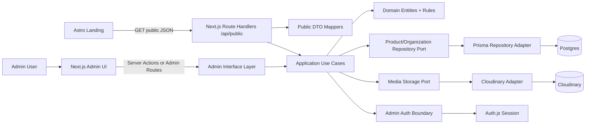
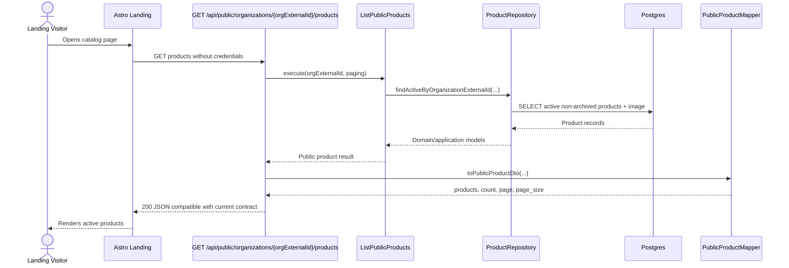
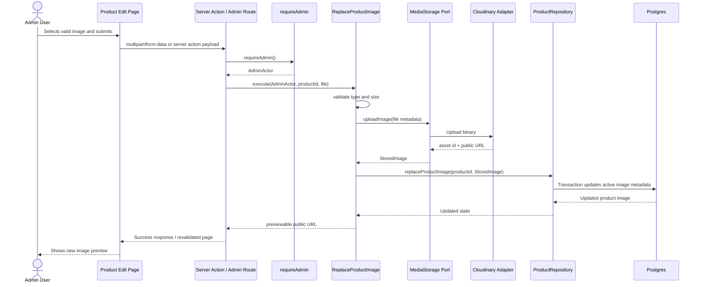

# Design — Owned Product Admin Backend

Change: `owned-product-admin-backend`

## Executive Summary

Build a separate Next.js 15 full-stack admin/backend application that owns catalog data, admin product management, image uploads, and landing-compatible public APIs for El Horno del Pingüino.

The recommended defaults are:

- **Runtime/app:** Next.js 15 App Router, TypeScript strict mode.
- **Database:** Postgres with Prisma ORM.
- **Database provider:** Neon for simple managed Postgres, or Supabase Postgres if the project also chooses Supabase Auth/Storage. Default for this design: **Neon Postgres**.
- **Auth:** Auth.js/NextAuth with a credentials or email provider restricted to an allowlisted admin account. Default for this design: **Auth.js**.
- **Image storage:** Cloudinary for simplest upload, preview, CDN delivery, and deletion semantics. Keep it behind a storage port so it can be replaced later.
- **Deployment:** Vercel for the Next.js app; managed Postgres and Cloudinary are external services.
- **Public API compatibility:** preserve the current landing contract for the first release.

Next.js hosts delivery mechanisms only. Domain rules, application use cases, persistence ports, storage ports, auth boundaries, and DTO mapping stay framework-independent and testable.

## Goals and Non-Goals

### Goals

- Own organization, product, and media metadata.
- Provide authenticated admin product CRUD.
- Support upload, preview, replacement, and removal of product images.
- Serve public organization and product endpoints compatible with the existing Astro landing.
- Keep active-product filtering server-side for public responses.
- Keep the cutover reversible through `PUBLIC_API_BASE_URL` and fallback JSON.
- Keep review slices small enough for the 400-line review budget.

### Non-Goals

- Checkout, payments, ordering, customer accounts, delivery logistics, promotions, analytics, or automated inventory.
- Complex RBAC beyond one protected admin/operator role.
- Landing redesign or requiring new landing DTO fields in the first release.
- Provider-specific image logic inside domain/application code.

## Architecture Overview



### Layer Responsibilities

| Layer | Owns | Must Not Own |
| --- | --- | --- |
| Domain | Product, organization, media concepts; validation; state transitions | Next.js, Prisma, Cloudinary, session APIs |
| Application | Use cases, ports, transaction boundaries, orchestration | HTTP request/response details, UI state |
| Infrastructure | Prisma, Postgres, Cloudinary, Auth.js adapters | Business rules hidden in ORM callbacks |
| Interface | App Router pages, route handlers, server actions, DTO mappers | Direct persistence or provider calls bypassing use cases |

## Suggested Repository and Folder Structure

Recommended: separate repository or separate app directory named `horno-product-admin`.

```text
horno-product-admin/
├── app/
│   ├── layout.tsx
│   ├── page.tsx
│   ├── admin/
│   │   ├── layout.tsx                 # authenticated admin shell
│   │   ├── login/page.tsx
│   │   └── products/
│   │       ├── page.tsx                # admin product list
│   │       ├── new/page.tsx
│   │       └── [productId]/page.tsx
│   └── api/
│       ├── public/
│       │   ├── organizations/route.ts
│       │   └── organizations/[orgExternalId]/products/route.ts
│       └── admin/
│           └── products/[productId]/image/route.ts # multipart upload if server actions are not enough
├── src/
│   ├── domain/
│   │   ├── organization.ts
│   │   ├── product.ts
│   │   ├── product-image.ts
│   │   └── money.ts
│   ├── application/
│   │   ├── ports/
│   │   │   ├── organization-repository.ts
│   │   │   ├── product-repository.ts
│   │   │   ├── media-storage.ts
│   │   │   └── admin-auth.ts
│   │   └── use-cases/
│   │       ├── list-public-organizations.ts
│   │       ├── list-public-products.ts
│   │       ├── create-product.ts
│   │       ├── update-product.ts
│   │       ├── archive-product.ts
│   │       ├── set-product-active-state.ts
│   │       ├── upload-product-image.ts
│   │       ├── replace-product-image.ts
│   │       └── remove-product-image.ts
│   ├── infrastructure/
│   │   ├── db/
│   │   │   ├── prisma.ts
│   │   │   └── repositories/
│   │   ├── media/
│   │   │   └── cloudinary-media-storage.ts
│   │   └── auth/
│   │       ├── auth-config.ts
│   │       └── require-admin.ts
│   ├── interface/
│   │   ├── dto/
│   │   │   ├── public-organization-dto.ts
│   │   │   └── public-product-dto.ts
│   │   ├── mappers/
│   │   │   ├── to-public-organization-dto.ts
│   │   │   └── to-public-product-dto.ts
│   │   └── validation/
│   │       ├── product-form-schema.ts
│   │       └── image-upload-schema.ts
│   └── tests/
│       ├── unit/
│       └── integration/
├── prisma/
│   ├── schema.prisma
│   ├── migrations/
│   └── seed.ts
└── package.json
```

Use `import "server-only"` in infrastructure modules that must never reach client components.

## Domain Model Direction

### Core Concepts

- **Organization:** owned business identity. Preserve `external_id = "horno-del-pinguino-92f9"`.
- **Product:** catalog item with public display fields and admin-managed state.
- **ProductImage / MediaAsset:** metadata for image storage and delivery.
- **AdminUser:** authenticated operator. Keep simple for first release.

### Product Rules

- Name is required.
- Price is non-negative and stored as cents or Decimal, not floating point for persistence.
- `is_active` controls public visibility.
- Product may exist without an image.
- Missing image maps to a safe `photo_url` representation compatible with the landing, currently an empty string is acceptable because `ProductCard.astro` already falls back when `photo_url` is falsy.
- Image replacement must not expose a half-updated public product state.

## Prisma/Postgres Model Direction

Use UUID primary keys internally. Preserve numeric-looking legacy fields only in public DTO mapping if required. Keep `externalId` stable for organization and products.

```prisma
model Organization {
  id             String    @id @default(uuid())
  externalId     String    @unique @map("external_id")
  name           String
  legalName      String    @map("legal_name")
  email          String
  description    String
  primaryColor   String    @map("primary_color")
  secondaryColor String    @map("secondary_color")
  tertiaryColor  String    @map("tertiary_color")
  logoUrl        String    @map("logo_url")
  address        String?
  telephone      String
  orgType        String    @map("org_type")
  isActive       Boolean   @default(true) @map("is_active")
  extraData      Json      @default("{}") @map("extra_data")
  products       Product[]
  createdAt      DateTime  @default(now()) @map("created_at")
  updatedAt      DateTime  @updatedAt @map("updated_at")

  @@map("organizations")
}

model Product {
  id             String        @id @default(uuid())
  externalId     String        @unique @map("external_id")
  organizationId String        @map("organization_id")
  organization   Organization  @relation(fields: [organizationId], references: [id])
  name           String
  description    String
  sku            String
  priceCents     Int           @map("price_cents")
  costCents      Int           @default(0) @map("cost_cents")
  stock          Int           @default(0)
  onDemand       Boolean       @default(true) @map("on_demand")
  perishable     Boolean       @default(true) @map("perecedero")
  isActive       Boolean       @default(false) @map("is_active")
  attributes     Json          @default("{}")
  image          ProductImage?
  createdAt      DateTime      @default(now()) @map("created_at")
  updatedAt      DateTime      @updatedAt @map("updated_at")
  archivedAt     DateTime?     @map("archived_at")

  @@index([organizationId, isActive])
  @@map("products")
}

model ProductImage {
  id                 String   @id @default(uuid())
  productId          String   @unique @map("product_id")
  product            Product  @relation(fields: [productId], references: [id])
  provider           String
  providerAssetId    String   @map("provider_asset_id")
  publicUrl          String   @map("public_url")
  width              Int?
  height             Int?
  contentType        String   @map("content_type")
  byteSize           Int      @map("byte_size")
  altText            String?  @map("alt_text")
  createdAt          DateTime @default(now()) @map("created_at")
  updatedAt          DateTime @updatedAt @map("updated_at")

  @@map("product_images")
}

model AdminUser {
  id        String   @id @default(uuid())
  email     String   @unique
  name      String?
  role      String   @default("admin")
  isActive  Boolean  @default(true) @map("is_active")
  createdAt DateTime @default(now()) @map("created_at")
  updatedAt DateTime @updatedAt @map("updated_at")

  @@map("admin_users")
}
```

Notes:

- `priceCents` prevents floating-point persistence errors. Public DTO maps it back to decimal dollars, e.g. `850 -> 8.5`.
- Keep `perecedero` as mapped column/DTO compatibility while using `perishable` internally.
- `archivedAt` supports safe admin removal without destructive deletion.
- Product image is modeled one-to-one for the first release. If galleries are needed later, migrate to one-to-many.

## Public DTO Mapping Contract

The public endpoints must expose the landing-compatible shape.

### Base URL Compatibility

Current landing config uses `PUBLIC_API_BASE_URL` defaulting to a URL ending in `/api`, then fetches paths like `/public/organizations`. Therefore the new deployment should support:

- Landing env: `PUBLIC_API_BASE_URL=https://admin.example.com/api`
- Actual route handler: `GET /api/public/organizations`
- Actual route handler: `GET /api/public/organizations/{orgExternalId}/products`

### Organization Response

```ts
interface OrganizationsResponse {
  organizations: PublicOrganizationDto[];
  count: number;
}
```

`PublicOrganizationDto` should preserve:

```ts
interface PublicOrganizationDto {
  id: number | string;
  external_id: string;
  name: string;
  legal_name: string;
  email: string;
  description: string;
  primary_color: string;
  secondary_color: string;
  tertiary_color: string;
  logo_url: string;
  address: string | null;
  telephone: string;
  org_type: string;
  is_active: boolean;
  extra_data: Record<string, string>;
  created_at: string;
}
```

### Products Response

```ts
interface ProductsResponse {
  products: PublicProductDto[];
  count: number;
  page: number;
  page_size: number;
}
```

`PublicProductDto` should preserve:

```ts
interface PublicProductDto {
  id: number | string;
  external_id: string;
  org_id: number | string;
  name: string;
  description: string;
  sku: string;
  price: number;
  cost: number;
  stock: number;
  on_demand: boolean;
  perecedero: boolean;
  photo_url: string;
  is_active: boolean;
  attributes: Record<string, unknown>;
  created_at: string;
  updated_at: string;
}
```

Mapping rules:

- Filter public products by `isActive = true` and `archivedAt = null` in the query/use case.
- Convert cents to decimal numbers only at the DTO boundary.
- Map `ProductImage.publicUrl` to `photo_url`; if absent, return `""` for current landing safety.
- Emit clean product names from owned data. Import should correct `Chesscake` to `Cheesecake`; the backend should not reproduce that typo.
- Do not add required landing dependencies on new fields during first release.

## Application Use Cases

### Public Read Use Cases

- `ListPublicOrganizations`
  - returns active organizations compatible with the landing response.
- `ListPublicProductsByOrganizationExternalId`
  - resolves organization by `externalId`.
  - returns active, non-archived products only.
  - supports `page` and `page_size` with defaults matching current expectations.

### Admin Product Use Cases

- `CreateProduct`
- `UpdateProduct`
- `ArchiveProduct` or `DeleteProduct`
- `SetProductActiveState`
- `UploadProductImage`
- `ReplaceProductImage`
- `RemoveProductImage`

All mutation use cases require an authenticated admin identity before executing.

### Transaction Boundaries

- Product create/update/archive should be single database transactions.
- Image replacement should:
  1. validate the upload request;
  2. upload the new asset;
  3. update DB metadata in a transaction;
  4. schedule or attempt old asset deletion after DB state is safe.
- If Cloudinary upload succeeds but DB update fails, attempt compensating deletion of the new asset and return a safe error.
- If old asset deletion fails after replacement, keep DB pointing to the new asset and log cleanup failure for retry/manual cleanup.

## Admin Auth Boundary

Recommended default: Auth.js session in the Next.js app.

Boundary rules:

- Public route handlers under `/api/public/**` never require auth.
- All admin pages under `/admin/**` require an authenticated active admin.
- All admin mutations require `requireAdmin()` at the interface boundary before calling use cases.
- The domain/application layers receive an `AdminActor` value, not raw Next.js session objects.
- Middleware may redirect `/admin/**` to login, but mutation handlers/server actions must still enforce auth server-side.
- First release supports a single admin/operator role. No complex permission matrix.

Suggested shape:

```ts
interface AdminActor {
  id: string;
  email: string;
  role: "admin";
}
```

Use the TypeScript const-object pattern in implementation rather than direct unions for runtime values.

## Image Storage Abstraction

Use a media storage port to isolate Cloudinary.

```ts
interface UploadImageInput {
  file: File | Blob;
  fileName: string;
  contentType: string;
  byteSize: number;
  folder: string;
}

interface StoredImage {
  provider: string;
  providerAssetId: string;
  publicUrl: string;
  width?: number;
  height?: number;
  contentType: string;
  byteSize: number;
}

interface MediaStorage {
  uploadImage(input: UploadImageInput): Promise<StoredImage>;
  deleteImage(providerAssetId: string): Promise<void>;
}
```

Validation defaults:

- Accepted types: `image/jpeg`, `image/png`, `image/webp`.
- Maximum size: 5 MB.
- Reject unsupported or oversized files before storage.
- Derive/fill `altText` from product name initially; allow admin override later if needed.

Admin UX flow:

- Show current image preview when present.
- Allow upload/replace from the product edit screen.
- Confirm removal to avoid accidental blank images.
- After upload/replace/remove, public DTO remains valid with either a public URL or empty string.

## Public Read Sequence



## Admin Image Upload Sequence



## Migration and Seed Design

### Source Data

Seed/import from the current external backend or `src/data/fallback.json` in the landing repo.

### Migration Rules

- Create organization with `externalId = "horno-del-pinguino-92f9"`.
- Preserve public fields needed by the landing.
- Convert decimal prices to cents.
- Correct known data defects during import, including `Chesscake` to `Cheesecake`.
- Set products active according to source `is_active`.
- Preserve `on_demand`, `perecedero`, SKU, stock, attributes, and timestamps where useful for compatibility.
- Avoid destructive source changes.

### Seed Script Behavior

- Idempotent upsert by `externalId`.
- Safe to run in staging more than once.
- Logs counts imported and skipped.
- Does not print secrets.

## Rollback and Cutover Design

### Cutover

1. Deploy owned backend/admin to staging.
2. Seed staging data.
3. Set landing staging `PUBLIC_API_BASE_URL=https://owned-backend-staging.example.com/api`.
4. Keep `PUBLIC_ORG_EXTERNAL_ID=horno-del-pinguino-92f9`.
5. Verify organization fetch, product rendering, active filtering, image loading, and fallback behavior.
6. Seed production.
7. Switch production `PUBLIC_API_BASE_URL` to owned backend.
8. Monitor public API and admin mutation logs.

### Rollback

- Revert only `PUBLIC_API_BASE_URL` to the previous external backend URL.
- Keep landing fallback JSON in place for the first release window.
- Do not remove frontend fallback behavior in this change.
- Do not remove old backend URL/config until the owned backend is stable.
- If image delivery fails, admins can remove/replace image metadata without deleting products.

### Database Rollback

- Use Prisma migrations with forward-only production discipline.
- Before production cutover, take a database backup/snapshot.
- For schema mistakes before cutover, reset/reseed staging only.
- For production after cutover, prefer additive corrective migrations over destructive rollback.
- Keep imported source/fallback data available so production can be reseeded if necessary.

## Operational Design

Required environment variables:

```text
DATABASE_URL=
AUTH_SECRET=
AUTH_TRUST_HOST=true
ADMIN_ALLOWED_EMAILS=
CLOUDINARY_CLOUD_NAME=
CLOUDINARY_API_KEY=
CLOUDINARY_API_SECRET=
NEXT_PUBLIC_APP_URL=
```

Operational ownership:

- Vercel owns app hosting and deploy logs.
- Neon/Supabase owns managed Postgres backups; backup policy must be documented before cutover.
- Cloudinary owns media storage and CDN delivery; credentials must be stored only as server secrets.
- Public route errors should log endpoint, organization external ID, and error category, never secrets.
- Admin mutation errors should log actor ID/email, use case name, product ID, and error category.

## Testing Strategy

Strict TDD applies during implementation. Tests should be written before behavior implementation.

Minimum coverage targets by behavior:

- Domain validation:
  - required name;
  - non-negative price;
  - active/inactive state transitions;
  - product remains valid without image.
- Public DTO mapping:
  - exact response wrappers: `organizations/count`, `products/count/page/page_size`;
  - cents-to-decimal price mapping;
  - missing image maps to `photo_url: ""`;
  - legacy-compatible field names.
- Public products use case:
  - only active non-archived products returned;
  - organization external ID lookup;
  - unauthenticated access allowed.
- Admin auth boundary:
  - unauthenticated mutation rejected with no state change;
  - authenticated admin mutation accepted.
- Image flows:
  - valid upload persists metadata and public URL;
  - invalid content type/size rejected before storage;
  - replace points product to new image;
  - remove leaves safe public DTO;
  - DB failure after upload triggers compensating cleanup attempt.
- Migration:
  - imports organization external ID;
  - corrects `Chesscake` to `Cheesecake`;
  - preserves compatibility fields.

Recommended test stack: Vitest for domain/application unit tests, Prisma integration tests against a test Postgres or isolated test database, and focused route-handler tests for public API compatibility.

## Review Slice Guidance

To protect the 400-line review budget, implementation should avoid bundling the full backend in one PR.

Recommended slices:

1. Project skeleton, strict TypeScript, test setup, folder boundaries.
2. Prisma schema, seed script, domain models, repository ports.
3. Public DTO mappers and public read use cases.
4. Public route handlers and compatibility tests.
5. Auth boundary and protected admin shell.
6. Product CRUD use cases/admin pages.
7. Image storage port and Cloudinary adapter.
8. Image upload/replace/remove UI and mutation flows.
9. Migration/cutover verification and landing env switch.

Auth, CRUD UI, and image upload slices are high risk for exceeding 400 changed lines and should be split further if needed.

## Key Design Decisions

- Use a separate Next.js 15 app, not a backend embedded in the Astro landing.
- Use clean architecture boundaries inside the app to keep rules testable.
- Use Postgres + Prisma for relational catalog data and migration clarity.
- Use Cloudinary behind a `MediaStorage` port for simple non-technical image workflows.
- Use Auth.js behind a `requireAdmin` boundary for first-release admin protection.
- Preserve current landing public DTO shape for first release.
- Return empty string for missing `photo_url` to match current landing fallback behavior.
- Store prices as cents internally and map to decimal only for compatibility.
- Prefer archive over destructive product deletion.
- Keep rollback through environment configuration, not frontend rewrites.

## Risks

- **Review size risk:** new app foundation plus auth/CRUD/uploads will exceed 400 lines if bundled. Mitigation: follow the review slices above.
- **Provider coupling risk:** Cloudinary details could leak into use cases. Mitigation: enforce `MediaStorage` port and adapter tests.
- **Auth bypass risk:** server actions and route handlers must each call `requireAdmin`; middleware alone is insufficient.
- **DTO drift risk:** changing public fields would force landing changes. Mitigation: lock mapper tests to current contract.
- **Migration quality risk:** imported data defects can become owned data. Mitigation: explicit cleanup rules and migration tests.
- **Operational risk:** app, database, storage, secrets, and backups are now owned by the project. Mitigation: document provider ownership before cutover.

## Next Recommended Phase

Proceed to `sdd-tasks` to convert this design and the specification into reviewable implementation tasks with explicit test-first work and PR boundaries.
